# UPI Payment Gateway 🚀

A production-grade, enterprise-level UPI payment gateway with real-time payment verification, dynamic QR code generation, and complete integration guide for any web application.

[](https://opensource.org/licenses/MIT)
[](https://nodejs.org/)

## ✨ Features

- **Real-time Payment Verification**: Automatic balance checking and instant payment confirmation
- **Dynamic QR Code Generation**: Generate UPI QR codes on-the-fly with custom amounts
- **Secure Session Management**: Nonce-based authentication prevents replay attacks
- **Rate Limiting & DDoS Protection**: Built-in throttling and security middleware
- **Scalable MongoDB Integration**: Automatic indexing and efficient data persistence
- **Comprehensive Logging**: Winston-based audit trails for all transactions
- **Production-Ready Security**: Helmet.js, CORS, input validation, XSS protection
- **Framework Agnostic**: Works with React, Vue, Angular, Next.js, Vanilla JS, and more

## 🏗️ System Architecture

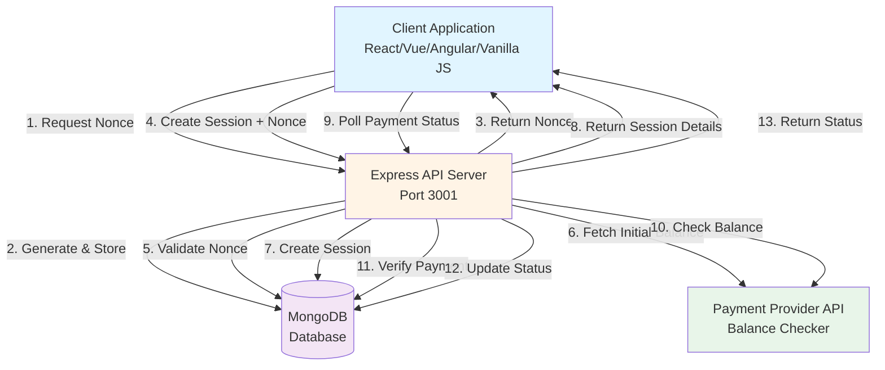

## � Quick Start Guide

### Prerequisites

- **Node.js** >= 18.0.0
- **MongoDB** >= 5.0 (local or MongoDB Atlas)
- **UPI ID** for receiving payments
- **Payment Provider API** (Mobikwik or any wallet API)

### 5-Minute Setup

```bash
# 1. Clone repository
git clone https://github.com/7ttp/upi-gateway.git
cd upi-gateway

# 2. Install dependencies
npm install

# 3. Configure environment
cp .env.example .env
# Edit .env with your credentials

# 4. Start server
npm start
```

Server runs on `http://localhost:3001`

### Environment Configuration

```env
# Server
PORT=3001
NODE_ENV=production

# Database (Local or MongoDB Atlas)
MONGODB_URI=mongodb://localhost:27017/upi_gateway
MONGODB_DB_NAME=upi_gateway

# Payment Provider
MOBIKWIK_AUTH=your_auth_token
MOBIKWIK_API_URL=https://webapi.mobikwik.com/p/wallet/balance

# UPI Details
UPI_ID=yourphone@paytm
UPI_PAYEE_NAME=Your Business Name

# Security
ALLOWED_ORIGINS=http://localhost:3000,https://yourdomain.com

# Session
SESSION_EXPIRY_MINUTES=10
RATE_LIMIT_MAX_REQUESTS=5
```

### Verify Installation

```bash
curl http://localhost:3001/health
```

**Expected Response:**
```json
{"status":"ok","timestamp":"2025-11-12T10:30:00.000Z"}
```

## 📡 API Documentation

### Overview

All endpoints require CORS whitelisting via `ALLOWED_ORIGINS`. Base URL: `http://localhost:3001/api`

### API Endpoints

| Method | Endpoint | Description |
|--------|----------|-------------|
| GET | `/nonce` | Generate security nonce |
| POST | `/create-payment-session` | Initialize payment |
| GET | `/payment-status/:orderId` | Check payment status |
| POST | `/payment-done` | Verify payment manually |
| POST | `/payment-cancel` | Cancel payment session |
| GET | `/upi-qr` | Generate QR code |
| GET | `/balance` | Get wallet balance |
| GET | `/order/:orderId` | Get order details |

---

### 1️⃣ Generate Nonce

**Endpoint:** `GET /api/nonce`

**Purpose:** Generate a single-use security token to prevent replay attacks.

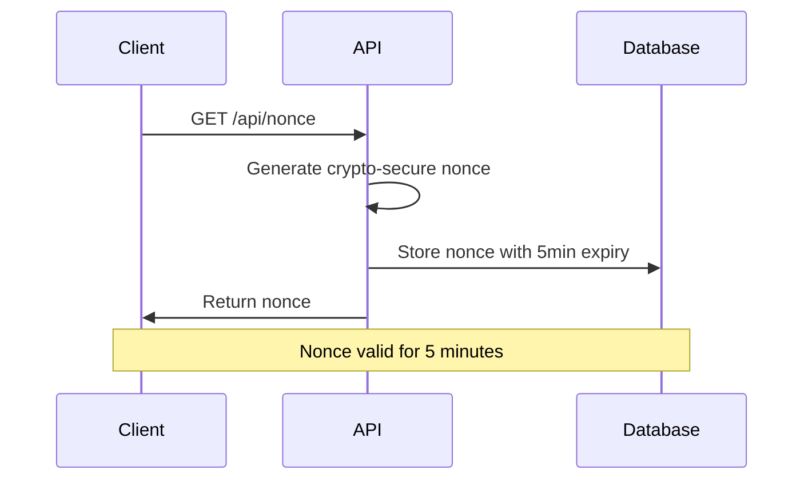

**Response:**
```json
{"nonce": "abc123def456..."}
```

---

### 2️⃣ Create Payment Session

**Endpoint:** `POST /api/create-payment-session`

**Purpose:** Initialize a new payment with order details and fetch initial balance.

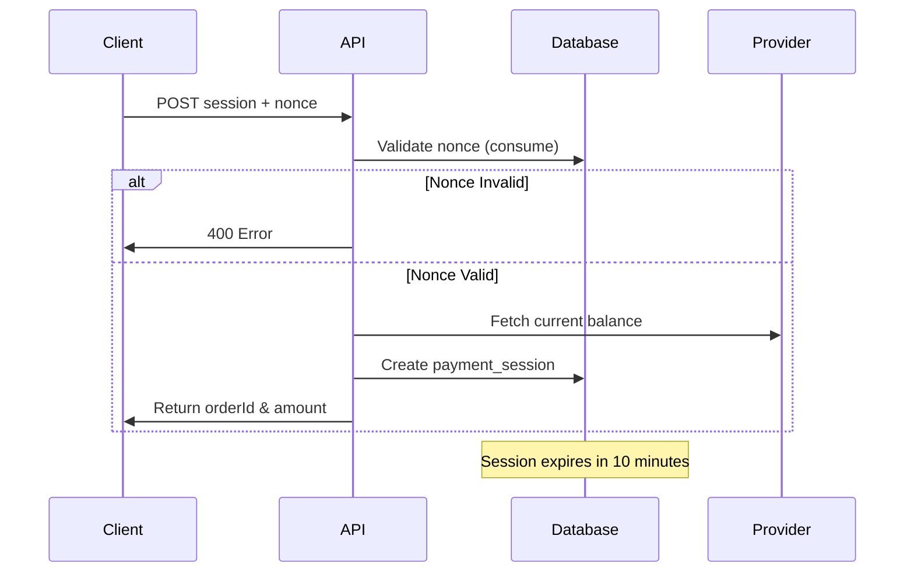

**Request:**
```json
{
  "orderId": "ORD-12345",
  "productDetails": {"name": "Product", "quantity": 1},
  "deliveryDetails": {"name": "John", "address": "123 St"},
  "email": "user@example.com",
  "basePrice": 1000,
  "tax": 18,
  "couponCode": "",
  "nonce": "abc123..."
}
```

**Response:**
```json
{"success": true, "orderId": "ORD-12345", "amount": 1018}
```

---

### 3️⃣ Check Payment Status

**Endpoint:** `GET /api/payment-status/:orderId`

**Purpose:** Poll payment status (recommended: every 5 seconds).

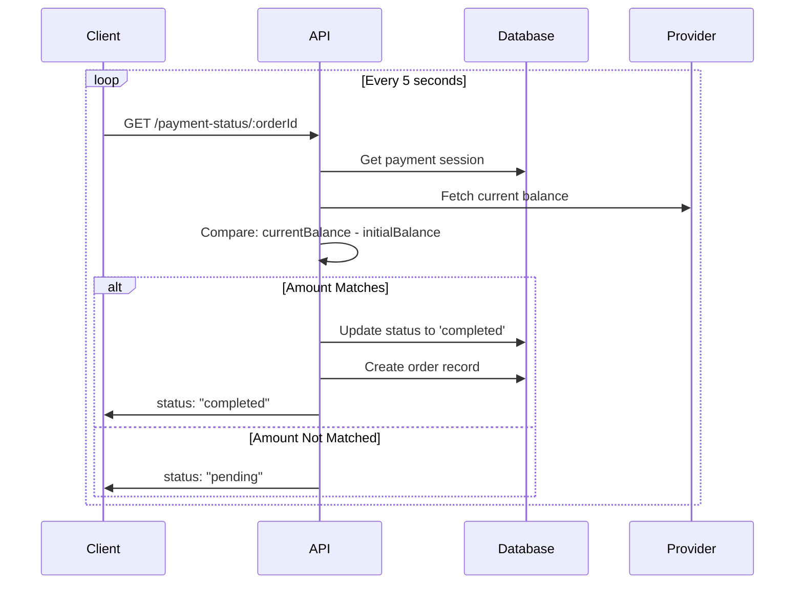

**Response:**
```json
{"status": "pending|completed|expired|cancelled"}
```

---

### 4️⃣ Verify Payment (Manual)

**Endpoint:** `POST /api/payment-done`

**Purpose:** Manual verification triggered by user clicking "I've Paid".

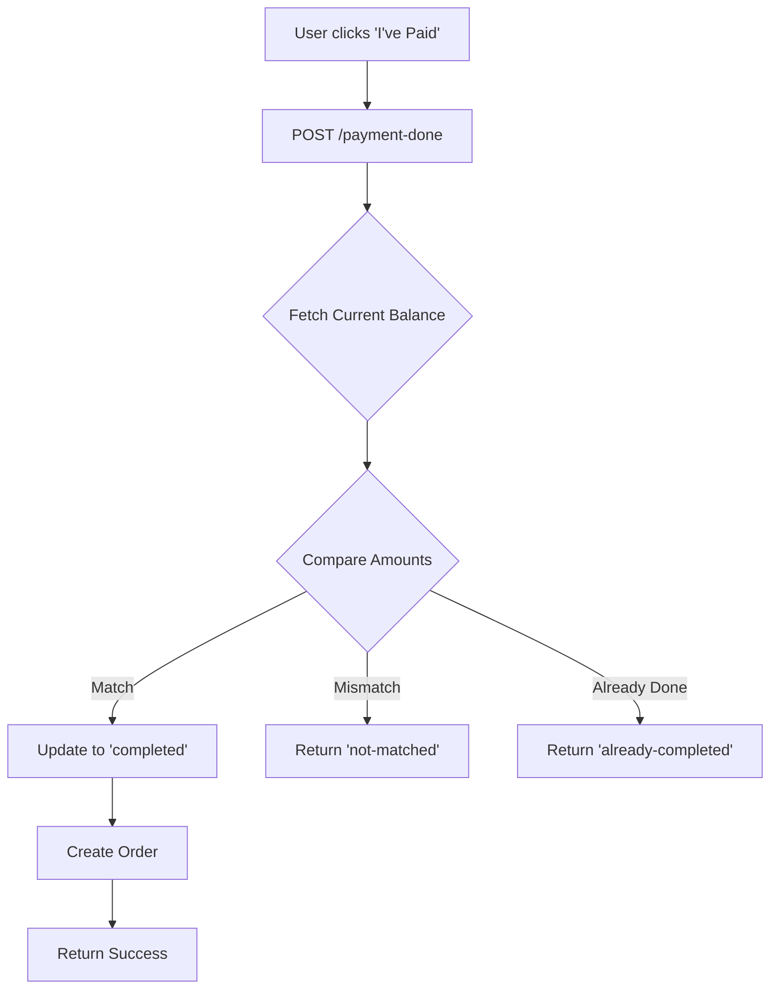

**Request:**
```json
{"orderId": "ORD-12345"}
```

**Response:**
```json
{"status": "completed", "diff": 1018, "expected": 1018}
```

---

### 5️⃣ Cancel Payment

**Endpoint:** `POST /api/payment-cancel`

**Purpose:** Cancel an ongoing payment session.

**Request:**
```json
{"orderId": "ORD-12345"}
```

**Response:**
```json
{"status": "cancelled"}
```

---

### 6️⃣ Generate UPI QR Code

**Endpoint:** `GET /api/upi-qr?amount=1000&note=Payment`

**Purpose:** Generate dynamic UPI QR code for payment.

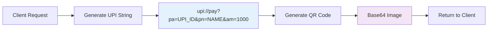

**Query Parameters:**
- `amount` (required): Payment amount
- `note` (optional): Payment note/description

**Response:**
```json
{
  "upiString": "upi://pay?pa=phone@paytm&pn=Business&am=1000",
  "qrCode": "data:image/png;base64,...",
  "upiId": "phone@paytm",
  "payeeName": "Business Name"
}
```

---

### 7️⃣ Get Balance

**Endpoint:** `GET /api/balance`

**Response:**
```json
{"balance": 5000.50}
```

---

### 8️⃣ Get Order Details

**Endpoint:** `GET /api/order/:orderId`

**Response:**
```json
{
  "success": true,
  "order": {
    "orderId": "ORD-12345",
    "totalAmount": 1018,
    "status": "confirmed",
    "createdAt": "2025-11-12T10:00:00.000Z"
  }
}
```

## 🔄 Complete Payment Flow

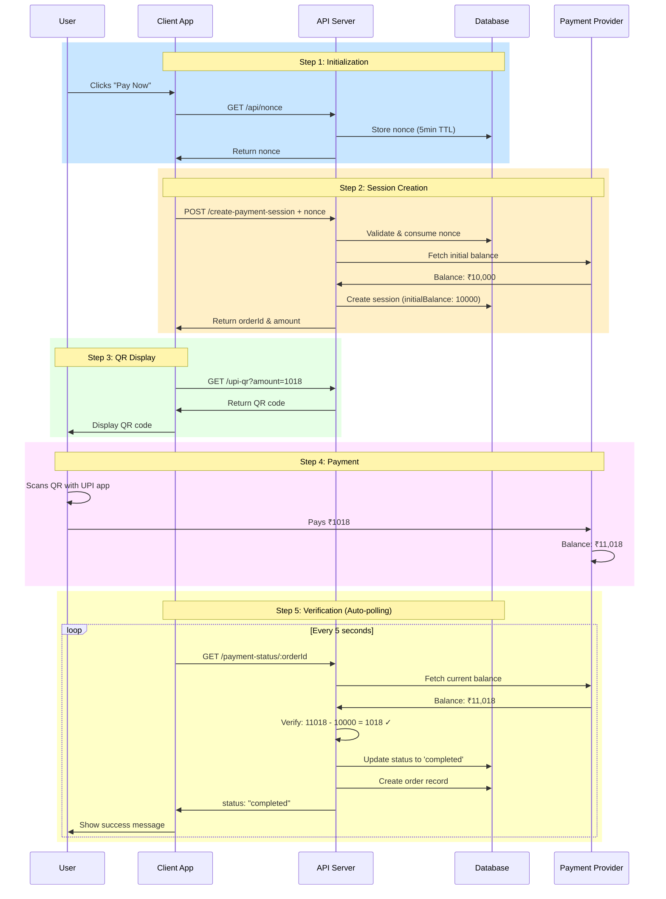

## 📊 Payment State Machine

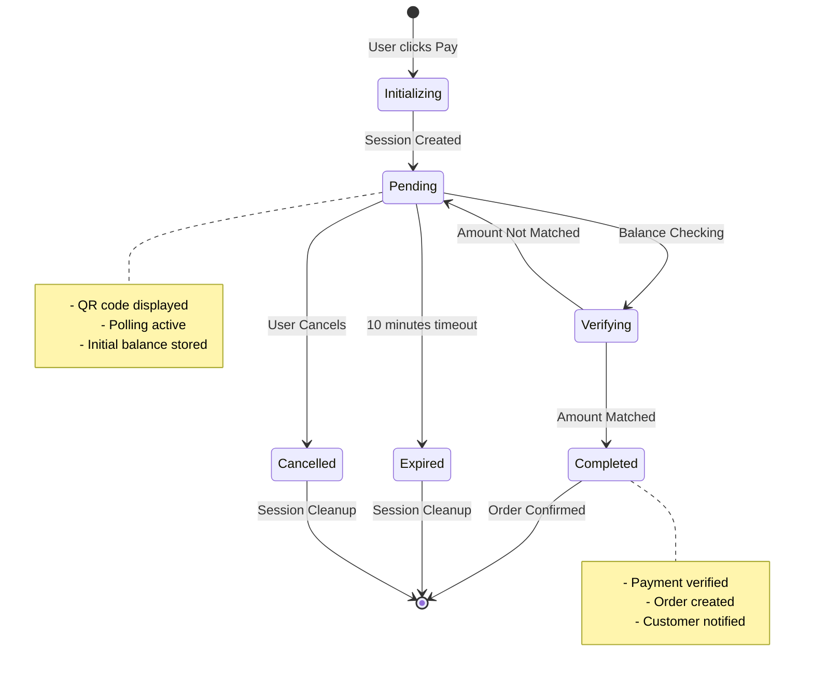

## 🗄️ Database Schema

### Collections Structure

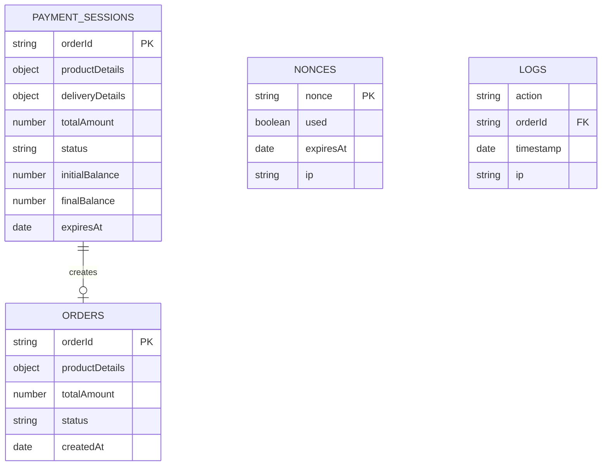

### Indexes

- `payment_sessions`: `orderId` (unique), `status`, `createdAt`, `expiresAt` (TTL)
- `orders`: `orderId` (unique), `createdAt`
- `nonces`: `nonce` (unique), `expiresAt` (TTL), `used`
- `logs`: `orderId`, `timestamp`

## 🔐 Security Features

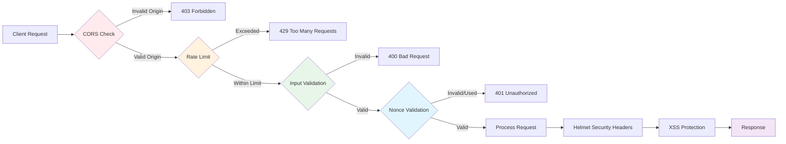

### Security Layers

1. **Helmet.js** - HTTP headers protection
2. **CORS** - Origin whitelisting
3. **Rate Limiting** - 5 requests per 10 minutes
4. **Input Validation** - Express-validator sanitization
5. **Nonce Authentication** - Single-use tokens (5min expiry)
6. **Session Expiry** - Auto-cleanup after 10 minutes
7. **XSS Protection** - Input/output sanitization
8. **MongoDB Injection** - Parameterized queries

## 🌐 Frontend Integration Guide

### Integration Flow

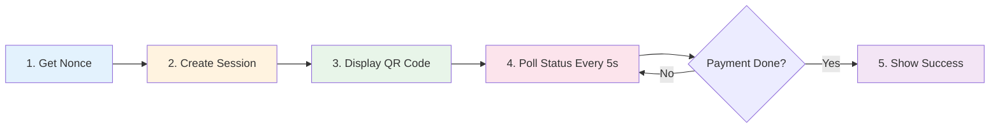

### Quick Integration Examples

#### React Hook (useUPIPayment)

```javascript
// hooks/useUPIPayment.js
import { useState } from 'react';
import axios from 'axios';

const API_URL = 'http://localhost:3001/api';

export const useUPIPayment = () => {
  const [loading, setLoading] = useState(false);

  const createPayment = async (orderData) => {
    setLoading(true);
    const { data: { nonce } } = await axios.get(`${API_URL}/nonce`);
    const session = await axios.post(`${API_URL}/create-payment-session`, {
      ...orderData,
      nonce
    });
    setLoading(false);
    return session.data;
  };

  const checkStatus = async (orderId) => {
    const { data } = await axios.get(`${API_URL}/payment-status/${orderId}`);
    return data.status;
  };

  return { createPayment, checkStatus, loading };
};
```

**Usage:**
```jsx
const { createPayment, checkStatus } = useUPIPayment();

// Create payment
const session = await createPayment({
  orderId: `ORD-${Date.now()}`,
  productDetails: { name: 'Product' },
  deliveryDetails: { name: 'John' },
  email: 'user@example.com',
  basePrice: 1000,
  tax: 18
});

// Poll status
setInterval(async () => {
  const status = await checkStatus(session.orderId);
  if (status === 'completed') {
    // Payment successful!
  }
}, 5000);
```

---

#### Vue.js Composable

```javascript
// composables/useUPIPayment.js
import { ref } from 'vue';
import axios from 'axios';

export const useUPIPayment = () => {
  const loading = ref(false);
  const API_URL = 'http://localhost:3001/api';

  const createPayment = async (orderData) => {
    loading.value = true;
    const { data: { nonce } } = await axios.get(`${API_URL}/nonce`);
    const { data } = await axios.post(`${API_URL}/create-payment-session`, {
      ...orderData, nonce
    });
    loading.value = false;
    return data;
  };

  return { createPayment, loading };
};
```

---

#### Vanilla JavaScript

```javascript
async function initPayment() {
  // Step 1: Get nonce
  const { nonce } = await fetch('http://localhost:3001/api/nonce')
    .then(r => r.json());

  // Step 2: Create session
  const session = await fetch('http://localhost:3001/api/create-payment-session', {
    method: 'POST',
    headers: { 'Content-Type': 'application/json' },
    body: JSON.stringify({
      orderId: `ORD-${Date.now()}`,
      productDetails: { name: 'Product' },
      deliveryDetails: { name: 'John' },
      email: 'user@example.com',
      basePrice: 1000,
      tax: 0,
      couponCode: '',
      nonce
    })
  }).then(r => r.json());

  // Step 3: Get QR code
  const qr = await fetch(
    `http://localhost:3001/api/upi-qr?amount=${session.amount}&note=Payment`
  ).then(r => r.json());

  // Display QR
  document.getElementById('qr').src = qr.qrCode;

  // Step 4: Poll status
  setInterval(async () => {
    const { status } = await fetch(
      `http://localhost:3001/api/payment-status/${session.orderId}`
    ).then(r => r.json());
    
    if (status === 'completed') {
      alert('Payment Successful!');
    }
  }, 5000);
}
```

---

#### Next.js API Route

```javascript
// pages/api/payment/create.js
import axios from 'axios';

export default async function handler(req, res) {
  const { data: { nonce } } = await axios.get('http://localhost:3001/api/nonce');
  const session = await axios.post('http://localhost:3001/api/create-payment-session', {
    ...req.body,
    nonce
  });
  res.json(session.data);
}
```

---

#### React Native (Mobile)

```javascript
import { useState, useEffect } from 'react';
import { View, Image, Text } from 'react-native';
import axios from 'axios';

export default function PaymentScreen() {
  const [qrCode, setQrCode] = useState(null);

  useEffect(() => {
    const initPayment = async () => {
      const { data: { nonce } } = await axios.get('http://YOUR_SERVER:3001/api/nonce');
      const session = await axios.post('http://YOUR_SERVER:3001/api/create-payment-session', {
        orderId: `ORD-${Date.now()}`,
        productDetails: { name: 'Product' },
        deliveryDetails: { name: 'John' },
        email: 'user@example.com',
        basePrice: 1000,
        tax: 0,
        nonce
      });

      const qr = await axios.get(
        `http://YOUR_SERVER:3001/api/upi-qr?amount=${session.data.amount}&note=Payment`
      );
      setQrCode(qr.data.qrCode);
    };

    initPayment();
  }, []);

  return (
    <View>
      <Text>Scan to Pay</Text>
      {qrCode && <Image source={{ uri: qrCode }} style={{ width: 300, height: 300 }} />}
    </View>
  );
}
```

## � Production Deployment

### Docker Deployment

```bash
# Using Docker Compose
docker-compose up -d

# Or manual build
docker build -t upi-gateway .
docker run -p 3001:3001 --env-file .env upi-gateway
```

### VPS Deployment (Ubuntu/Debian)

```bash
# Install dependencies
curl -fsSL https://deb.nodesource.com/setup_18.x | sudo -E bash -
sudo apt-get install -y nodejs mongodb
sudo npm install -g pm2

# Clone and setup
git clone your-repo && cd upi-payment-gateway
npm install --production
cp .env.example .env && nano .env

# Start with PM2
pm2 start server/index.js --name upi-gateway
pm2 startup && pm2 save
```

### Nginx Reverse Proxy

```nginx
server {
    listen 80;
    server_name api.yourdomain.com;

    location / {
        proxy_pass http://localhost:3001;
        proxy_http_version 1.1;
        proxy_set_header Host $host;
        proxy_set_header X-Real-IP $remote_addr;
        proxy_set_header X-Forwarded-For $proxy_add_x_forwarded_for;
    }
}
```

**Enable SSL:**
```bash
sudo apt install certbot python3-certbot-nginx
sudo certbot --nginx -d api.yourdomain.com
```

## 🔧 Testing & Monitoring

### Quick Tests

```bash
# Health check
curl http://localhost:3001/health

# Get nonce
curl http://localhost:3001/api/nonce

# Generate QR
curl "http://localhost:3001/api/upi-qr?amount=100&note=Test"
```

### Monitoring Checklist

- [ ] Server health endpoint responding
- [ ] MongoDB connection stable
- [ ] Payment provider API accessible
- [ ] Logs writing to `logs/` directory
- [ ] Rate limiting working
- [ ] CORS configured correctly
- [ ] SSL certificate valid (production)

### Logs Location

- **Error logs**: `logs/error.log`
- **All logs**: `logs/combined.log`

```bash
# View live logs
tail -f logs/combined.log

# PM2 logs
pm2 logs upi-gateway
```

## 🛠️ Troubleshooting

| Issue | Solution |
|-------|----------|
| **CORS Error** | Add domain to `ALLOWED_ORIGINS` in `.env` |
| **MongoDB Connection Failed** | Check `MONGODB_URI` and MongoDB service status |
| **Payment Not Detecting** | Verify exact amount match with decimals |
| **Rate Limit Exceeded** | Increase `RATE_LIMIT_MAX_REQUESTS` |
| **Port Already in Use** | Change `PORT` or kill process: `lsof -ti:3001 \| xargs kill` |
| **QR Code Not Showing** | Check browser console and API URL |

## 💡 Best Practices

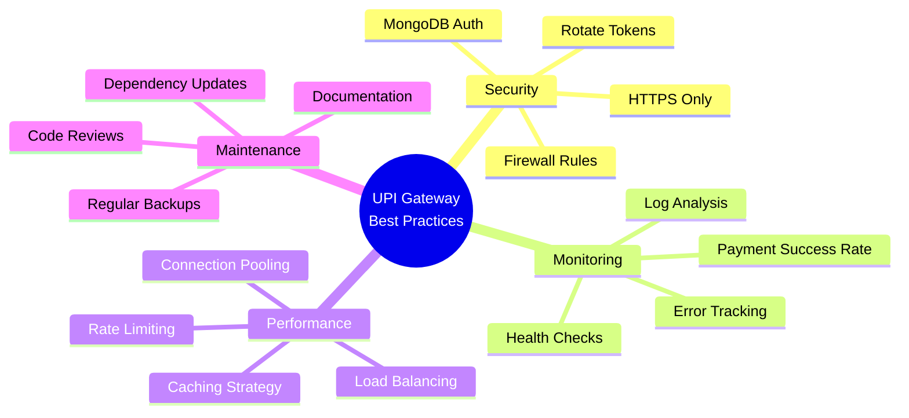

### Production Checklist

- [ ] Environment variables secured
- [ ] HTTPS enabled with valid SSL
- [ ] MongoDB authentication enabled
- [ ] Rate limiting configured
- [ ] Error logging implemented
- [ ] Backup strategy in place
- [ ] CORS origins whitelisted
- [ ] Health check endpoint tested
- [ ] Payment flow tested end-to-end
- [ ] Documentation updated

## 📚 Additional Resources

- **Express.js**: [expressjs.com](https://expressjs.com)
- **MongoDB**: [mongodb.com/docs](https://www.mongodb.com/docs/)
- **Docker**: [docs.docker.com](https://docs.docker.com)
- **PM2**: [pm2.keymetrics.io](https://pm2.keymetrics.io)
- **Nginx**: [nginx.org/en/docs](https://nginx.org/en/docs/)

## 📄 License

MIT License - See [LICENSE](LICENSE) file for details.

---

<div align="center">

### 🎉 You're Ready to Accept UPI Payments!

**Production-Grade • Secure • Scalable • Framework Agnostic**

Made with ❤️ by **Vaibhav**

</div>
